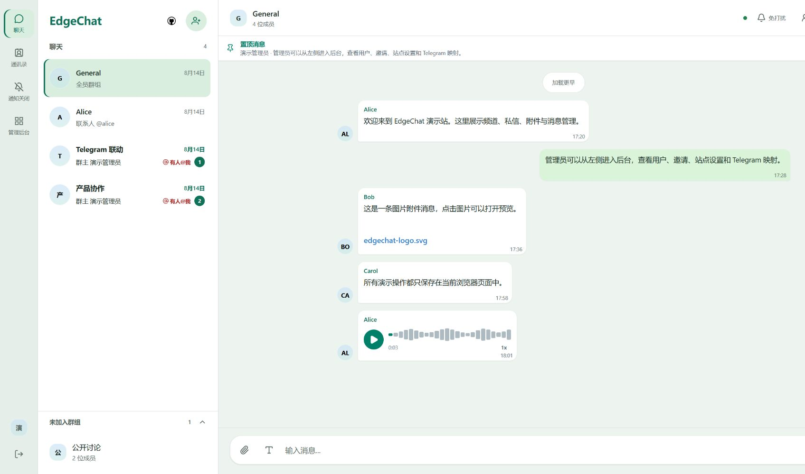
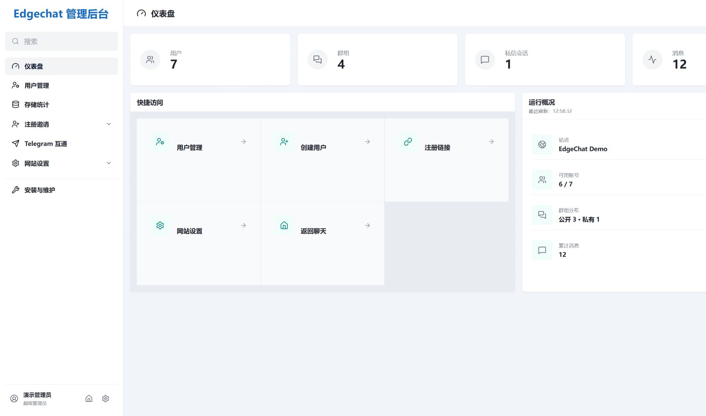

<details>
<summary><b>📢 EdgeChat 合作与广告位</b></summary>
<br />

EdgeChat 面向开发者、Cloudflare 用户及自托管社区，目前 GitHub 已有 666 Star，README 长期保持较高曝光。

如果你的产品或服务面向 **开发者工具、云服务、自托管应用或开源生态**，可以考虑在 README 中投放展示位：

- **Sponsor — $5 / 月**
  在 Sponsors 区域展示 Logo、名称及跳转链接。
- **Featured Sponsor — $10 / 月**
  更靠前的展示位置，更大尺寸 Logo，附一句话简介。

投放内容仅限与开发者工具、云服务、自托管产品、开源生态相关的品牌，以保证读者体验的相关性。

如需投放，欢迎通过 [Telegram 社区](https://t.me/EdgeChatlounge)或提交 [Issue](https://github.com/aozorae/Edgechat/issues) 联系洽谈。

</details>

<div align="center">
  

  <h3>自己的聊天空间，不必从维护服务器开始。</h3>
  <p>基于 Cloudflare 的开源自部署团队聊天系统</p>
  <p>实时群聊与私信 · Telegram 双向桥接 · 语音与文件 · 消息与附件服务端加密</p>

  <p>
    
    
    
    
    
  </p>

  <p>
    <a href="README.md"><b>中文</b></a> ·
    <a href="README.en.md">English</a> ·
    <a href="README.ja.md">日本語</a> ·
    <a href="https://edgechat-demo.wcjxxgaq.workers.dev">在线演示</a> ·
    <a href="https://echat.azora.top/">项目文档</a> ·
    <a href="https://t.me/EdgeChatlounge">Telegram 社区</a>
  </p>
</div>

<br />

**EdgeChat 是一个运行在 Cloudflare 上的开源团队聊天系统。** 你可以用它为团队、项目或小圈子搭建一个独立的聊天空间：讨论放进群组，私事留给私信，语音和文件也能随手分享。

它不需要你另外维护一台常驻服务器。应用与数据资源部署在你自己的 Cloudflare 账号下，通过 GitHub Actions 自动部署和更新。如果成员已经在使用 Telegram，也可以把两侧群组连接起来，继续使用各自习惯的聊天入口。

[界面预览](#界面预览) · [在线演示](#在线演示) · [Telegram 桥接](#telegram-双向桥接) · [功能特性](#功能特性) · [隐私与加密](#隐私与加密) · [部署](#部署) · [本地开发](#本地开发)

## 界面预览

<table>
  <tr>
    <td width="50%" align="center"><strong>聊天界面</strong></td>
    <td width="50%" align="center"><strong>管理后台</strong></td>
  </tr>
  <tr>
    <td width="50%"></td>
    <td width="50%"></td>
  </tr>
</table>

## 在线演示

**[打开 EdgeChat 在线演示 →](https://edgechat-demo.wcjxxgaq.workers.dev)**

先看看界面，再决定是否部署。

演示站复用正式项目的 Vue 页面、路由、状态管理和实时消息逻辑，但 API、WebSocket、文件上传与 Telegram 回流均在浏览器内存中模拟，不是连接真实后端的多人聊天室。

刷新页面或点击右上角「重置演示数据」即可恢复初始状态。演示操作不会访问正式 Worker，也不会写入 D1、KV 或 R2。

## 为什么是 EdgeChat

EdgeChat 面向这样一种需求：**想拥有一个自己的聊天空间，又不想为此长期维护服务器、数据库和一整套运行环境。**

| 你关心的事情 | EdgeChat 的做法 |
|---|---|
| 部署和维护 | 基于 Cloudflare Workers，无需另行维护常驻服务器；支持 GitHub Actions 自动部署 |
| 成员与管理 | 提供独立账号、公开与私有群组、私信和管理后台 |
| 已有的 Telegram 群 | 通过 Bot 双向桥接，让两侧成员继续使用各自习惯的入口 |
| 自己修改与扩展 | 源码开放，可以按自己的需求调整界面和功能 |

项目本身免费开源。云服务费用取决于 Cloudflare 的套餐、资源配置和实际用量。

## Telegram 双向桥接

**不用把所有人都搬进同一个应用。**

管理员可以将 EdgeChat 群组与 Telegram 群组绑定，通过 Telegram Bot 双向转发消息：在网页里发出的消息可以同步到 Telegram，Telegram 群里的消息也会回到 EdgeChat。

适合已经有 Telegram 群、同时又需要一个独立网页聊天入口的团队和社区。

<div align="center">
  
  <br />
  <sub>两个聊天入口，同一段讨论。</sub>
</div>

## 功能特性

### 💬 聊天与会话

- 公开群组、私有群组和一对一私信。
- 实时消息、历史消息分页、语音消息与文件分享。
- 消息回复、引用跳转、@ 提及与回复提醒。
- 私信联系人拉黑与解除拉黑；拉黑期间双方均无法继续发送私信。
- 支持定时硬删除过期消息。

### 🎨 日常使用体验

- Liquid Glass 风格界面，适配桌面和移动端。
- 语音录制、波形进度与倍速播放。
- 网页前台提供站内消息通知；后台可使用浏览器系统通知，需要用户授权。
- 文件上传、头像管理与基础无障碍支持。

### 🛠 实例管理

- 仪表盘、用户管理、注册邀请与网站设置。
- 支持永久封禁和按天、小时、分钟设置临时封禁；临时封禁到期后自动恢复，无需额外定时任务。
- 在浏览器端直接比对源码仓库，检查当前部署是否有更新。

### 🔌 连接与扩展

- Telegram 群组双向消息桥接，支持语音消息同步。
- WebMCP 站点工具：在兼容的客户端环境中，提供登录、查询会话、读取与发送消息等能力。

## 隐私与加密

EdgeChat 对**新写入的消息正文和新上传的附件**使用 AES-256-GCM 服务端静态加密。历史明文数据保持原状，读取时兼容新旧数据，不会在部署或后台任务中批量回填加密。

管理员后台不提供群组或私信消息正文的查看入口，仍可查看消息数量等聚合统计。

> [!NOTE]
> **这是服务端加密，不是端到端加密。**
> Worker 在通过会话权限校验后解密内容，Cloudflare 运行环境和掌握密钥的部署方仍需要被信任。后台没有消息查看入口，不代表部署者在技术上无法访问内容。
>
> 开启 Telegram 桥接后，被转发的消息也会进入对应的 Telegram 会话。

<details>
<summary><strong>密钥管理与轮换说明</strong></summary>

<br />

GitHub Actions 会管理服务端加密 Worker Secrets。首次部署时，如果目标 Worker 尚无加密 Secret，工作流会自动生成随机 32 字节 AES 密钥，以独立的版本化 Secret 注入，并记录当前 active key ID。后续普通部署只检查这些 Secret 是否存在，不会重新生成、覆盖或轮换。

生产环境已经存在的 `EDGECHAT_ENCRYPTION_KEYRING` JSON 密钥环会被原样保留并继续兼容。

需要手动指定密钥时，可创建名为 `EDGECHAT_ENCRYPTION_KEYRING` 的 GitHub Repository Secret：

```json
{"activeKeyId":"v1","keys":{"v1":"BASE64_ENCODED_32_BYTE_KEY"}}
```

首次部署会直接采用该值。

已有 Worker 需要自动增量轮换时，手动运行 `Deploy Worker` 并勾选 `rotate_encryption_key`。工作流只新增一个版本化密钥 Secret，并把 active key ID 切换到新版本；所有旧 Secret 和旧 JSON 密钥环都保持不变。新消息使用新密钥，旧密文继续使用各自信封中的 key ID 解密。

`apply_encryption_keyring` 是备用的手动覆盖入口。使用时，Repository Secret 中必须是完整 JSON 密钥环，`keys` 需要保留所有仍被历史密文引用的旧 key ID，再增加新 key 并更新 `activeKeyId`。

**删除旧 key 会导致对应历史密文永久无法读取。** `apply_encryption_keyring` 与 `rotate_encryption_key` 不能在同一次运行中同时启用。

</details>

## 技术栈

| 部分 | 技术 |
|---|---|
| 前端 | Vue 3、Vue Router、Vite |
| 后端 | Cloudflare Workers、Hono |
| 实时通信 | Durable Objects、WebSocket Hibernation |
| 数据库 | Cloudflare D1 |
| 会话存储 | Cloudflare KV |
| 文件存储 | Cloudflare R2 |
| 构建与部署 | Wrangler、GitHub Actions |

更多实现说明见 [TECHNICAL.md](TECHNICAL.md)。

## 部署

### GitHub Actions 自动部署

推荐使用仓库内置的 GitHub Actions 工作流进行部署和后续更新。

按照文档完成 Cloudflare 授权与仓库配置后，可以手动运行 `Deploy Worker`，也可以通过向 `master` 或 `main` 分支推送代码触发部署。工作流文件为 `.github/workflows/deploy-worker.yml`。

**[快速开始](https://echat.azora.top/guide/getting-started.html) · [GitHub Actions 部署教程](https://echat.azora.top/guide/actions-deploy.html)**

### 手动部署与 Docker

本地手动部署的资源准备、配置方法和注意事项见 [部署文档](https://echat.azora.top/guide/getting-started.html)。

Docker 相关说明见 [DOCKER.md](DOCKER.md)。

### Android 客户端

<details>
<summary>查看客户端、安装与构建说明</summary>

<br />

`capacitor/` 客户端的 APK 内置 Vue Web UI，并通过少量 Kotlin 对接系统文件选择、通知、麦克风权限、通知会话跳转和外部链接。包名为 `com.aozorae.edgechat.web`，首次登录时填写自己的 EdgeChat HTTPS 服务地址，不绑定固定部署。

- 安装包：从 [GitHub Releases](https://github.com/aozorae/Edgechat/releases) 下载 `edgechat-*.apk`，并核对 `SHA256SUMS.txt`。
- 首次使用：填写自己的 EdgeChat HTTPS 服务地址、账号和密码。
- 本地构建：准备 JDK 21 与 Android SDK 36 后，运行 `npm run build:capacitor`。
- Debug APK：`capacitor/android/app/build/outputs/apk/debug/app-debug.apk`。
- CI：`.github/workflows/capacitor-android-ci.yml` 上传 `edgechat-capacitor-debug`。
- 发布：推送 `android-v*` 标签或手动运行 `Android Release`，使用四个 `ANDROID_KEYSTORE_*` Secrets 构建签名 APK/AAB。
- 服务切换：退出登录后可以修改地址；切换实例时自动清理旧实例令牌。

当前不包含 Room 离线数据库、WorkManager Outbox 或 FCM；应用停止接收消息时，不承诺后台即时通知。

原生 `android/` Kotlin + Jetpack Compose 客户端暂时弃用，不再作为默认发行版。源码、API v1 契约与独立 CI 暂时保留。

完整说明见 [Android 客户端文档](https://echat.azora.top/guide/android.html)。

</details>

## 本地开发

```bash
# 获取源码
git clone https://github.com/aozorae/Edgechat.git
cd Edgechat

# 安装依赖
npm install

# 启动纯前端演示，无需先部署云端资源
npm run dev:demo
```

连接实际后端进行开发或部署前，请先按照文档准备对应的 Cloudflare 资源与配置。

```bash
# 前端开发
npm run dev:frontend

# 本地构建
npm run build

# 本地手动发布
npm run deploy
```

<details>
<summary>演示站构建、部署与 CI 环境变量</summary>

<br />

```bash
# 独立构建演示站
npm run build:demo

# 部署独立演示 Worker
npm run deploy:demo
```

演示站使用 `wrangler.demo.toml` 和 `.github/workflows/deploy-demo.yml`，Worker 名称为 `edgechat-demo`。GitHub Actions 仅支持手动触发，并读取 `DEMO_CLOUDFLARE_ACCOUNT_ID`、`DEMO_CLOUDFLARE_API_TOKEN`，不会改变现有生产部署工作流。

在非交互环境下部署时，需要提前设置 `CLOUDFLARE_API_TOKEN`。

后台更新检查会在构建时自动记录当前 GitHub 仓库、分支和提交。为了获得准确结果，手动部署应在 Git 仓库内基于已经推送的干净提交构建；源码仓库需要保持公开，浏览器才能直接调用 GitHub Compare API，整个过程不会创建定时任务。

PowerShell 示例：

```powershell
$env:CLOUDFLARE_API_TOKEN = "your-token"
npm run deploy
```

</details>

## 项目结构

<details>
<summary>查看主要目录</summary>

```text
Edgechat/
├─ assets/previews/       # 界面预览
├─ frontend/             # Vue 前端与浏览器内演示
├─ worker/
│  ├─ schema.sql         # 数据库结构
│  ├─ migrations/        # 数据库迁移
│  └─ src/               # API、认证与 Durable Objects
├─ capacitor/            # 基于 Web UI 的 Android 客户端
├─ android/              # 暂时保留的原生 Android 客户端
├─ .github/workflows/    # 自动部署与 CI
├─ wrangler.toml
├─ wrangler.demo.toml
├─ package.json
├─ README.md
├─ README.en.md
├─ README.ja.md
└─ LICENSE
```

</details>

## 交流与贡献

遇到问题、想讨论功能，或者有自己的使用方式，欢迎提交 [Issue](https://github.com/aozorae/Edgechat/issues)，也欢迎加入 [Telegram 社区](https://t.me/EdgeChatlounge)。

代码、文档、翻译与问题反馈都可以帮助项目继续完善。欢迎提交 Pull Request。

感谢所有为 EdgeChat 提供帮助的贡献者：

[](https://github.com/aozorae/Edgechat/graphs/contributors)

## Star History

<a href="https://www.star-history.com/?type=date&repos=aozorae%2FEdgechat">
 <picture>
   <source media="(prefers-color-scheme: dark)" srcset="https://api.star-history.com/chart?repos=aozorae/Edgechat&type=date&theme=dark&legend=top-left&sealed_token=GpyqTbdwb3a2OHOT-WlCSoSzrumr3iwtcNluTpGbcU5CuyfP4eKf9TjtDuJ2uY4XK0P6knEB6OFCkbaAMsMCO3vnGPprGvB4f4rd7kmbUNe3fJ8LNaaGVH7JZLDT7SNNy3DC-sBxZwBmfL7gP9AFv1iKX1FgYnRZuOBGcKkbWFlBuoq2TXpYIfWmoUF9" />
   <source media="(prefers-color-scheme: light)" srcset="https://api.star-history.com/chart?repos=aozorae/Edgechat&type=date&legend=top-left&sealed_token=GpyqTbdwb3a2OHOT-WlCSoSzrumr3iwtcNluTpGbcU5CuyfP4eKf9TjtDuJ2uY4XK0P6knEB6OFCkbaAMsMCO3vnGPprGvB4f4rd7kmbUNe3fJ8LNaaGVH7JZLDT7SNNy3DC-sBxZwBmfL7gP9AFv1iKX1FgYnRZuOBGcKkbWFlBuoq2TXpYIfWmoUF9" />
   
 </picture>
</a>

## 协议说明

本项目采用 **GNU GPL v3.0 or later**，详见 [LICENSE](LICENSE)。

## 鸣谢

<div align="center">

### ✨ 特别鸣谢

<table>
<tr>
<td align="center" width="140">
<a href="https://github.com/VenLac">

</a>
</td>
<td>

**[VenLac](https://github.com/VenLac)**（Venlacy）

[](https://github.com/VenLac)

项目早期贡献了大量核心代码，为 EdgeChat 的整体架构奠定了基础；
同时凭借自身在社区中的影响力，为项目推广做出了突出贡献。让更多开发者认识并使用了 EdgeChat。

</td>
</tr>
</table>

</div>

<br>

感谢 [linux do](https://linux.do) 在推广方面为本项目做出的贡献。

## 免责声明

EdgeChat 是一个自部署的开源项目。项目维护者仅提供软件本身，不运营、控制或管理任何由用户自行部署的实例。

实例的部署者和使用者应自行对其部署方式、使用行为及其中产生的内容和数据负责。

项目维护者不对任何独立部署实例的使用或滥用承担责任。
